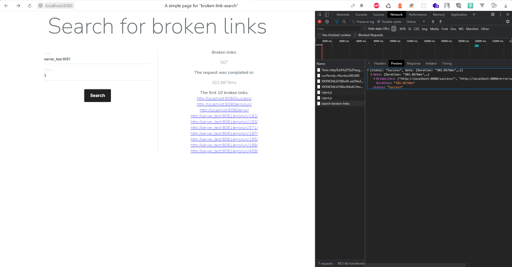

# Broken link checker

## Task description

    Иногда такое бывает, что сайты имеют поломанные (невалидные) ссылки.
    Нужно разработать приложение (бек и простой фронт), которое умеет  бегать по сайту и выдавать  поломанные ссылки.
    Ссылка является битой, когда http status находится в диапазоне 4xx .  Приложение будет одностраничным - список битых ссылок, а также форма (интерфейс для ввода) url сайта и глубины поиска ссылок (максимум переходов по ссылкам вглубь сайта).
    Особое внимание уделить производительности. Т.к ссылок может быть много и нужно решить задачу эффективно.
    
    Сайт, на котором можно тренироваться искать битые ссылки: http://target.true-tech.php.nixdev.co/

**In fact**:

Develop a system for finding broken links. The link is broken when the http status is 4xx.
    
Input: link string, depth int. 
    
Output: broken-links []string

The provided link for the test: 
http://target.true-tech.php.nixdev.co/

##How use

    make run - run project in docker container. 
    make run_checker - run 'broken-link-checker' in IDE. (race mode)
    make run_server_test - run server for the test in IDE. 
    make link - control of the code style. 

After executing "make run", open "http://localhost:8080".
The test server will be available at: 
 - "http://server_test:8081" - for the container;
 - "http://localhost:8081" - for the user;

##how it looks like

